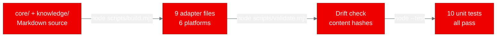
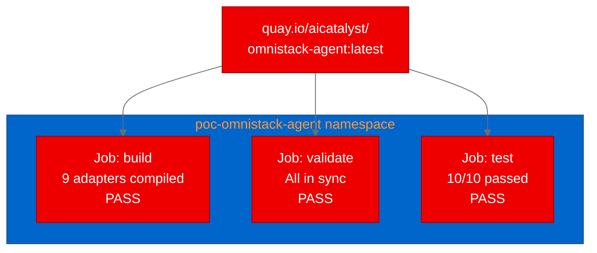

## Running an AI prompt build pipeline on Red Hat OpenShift AI

*How we containerized omnistack-agent and ran build, validate, and test as Kubernetes Jobs*

AI agents run on prompts, and prompts are becoming a build artifact problem. When a single set of agent instructions needs to target ChatGPT, Claude, Copilot, Gemini, Cursor, and generic LLMs, you need a compilation step. You need drift detection. You need tests. You need the same pipeline discipline that application code gets.

[omnistack-agent](https://github.com/Ricar66/omnistack-agent) treats this problem seriously. It's a zero-dependency Node.js project that compiles a single source of agent instructions into 9 adapter files for 6 platforms, with content-hash validation and 10 unit tests. We wanted to know: can this kind of prompt engineering tooling run as containerized batch workloads on [Red Hat OpenShift AI](https://www.redhat.com/en/technologies/cloud-computing/openshift/openshift-ai)? The answer is yes, and it took less than 8 seconds.

## What omnistack-agent does

omnistack-agent turns a set of markdown files into platform-specific AI agent instructions. The source material lives in two directories:

- core/ contains the agent's identity, principles, capabilities, workflow, interaction style, and guardrails
- knowledge/ holds modular topic files covering architecture, backend, frontend, databases, DevOps, and more

A Node.js build script reads these files, assembles them into a unified prompt, and renders 9 adapter files for ChatGPT (custom GPT instructions and system prompt), Claude (skill, agent, and AGENTS.md), GitHub Copilot, Gemini, Cursor, and a generic system prompt. Each adapter includes a content hash for drift detection.

The project has zero npm dependencies. The build, validate, and test scripts all use Node.js built-in modules.

## Containerizing with Universal Base Image

We created a `Dockerfile.ubi` using `registry.access.redhat.com/ubi9/nodejs-22`, the Red Hat Universal Base Image (UBI) for Node.js. Since the project has no runtime dependencies, the Dockerfile is minimal:

```dockerfile
FROM registry.access.redhat.com/ubi9/nodejs-22

WORKDIR /opt/app-root/src
COPY package.json ./
RUN npm install --production 2>/dev/null || true
COPY . .

USER 0
RUN chgrp -R 0 /opt/app-root && chmod -R g=u /opt/app-root
USER 1001

ENTRYPOINT ["node"]
CMD ["--help"]
```

The image built on the first attempt using an OpenShift BuildConfig with binary input. No build retries were needed.



## Deploying as Kubernetes Jobs

We deployed three Kubernetes Jobs in the `poc-omnistack-agent` namespace, one for each pipeline stage: build, validate, and test. Each Job runs a single Node.js command and exits.

```yaml
apiVersion: batch/v1
kind: Job
metadata:
  name: omnistack-agent-build
  namespace: poc-omnistack-agent
spec:
  backoffLimit: 1
  activeDeadlineSeconds: 120
  template:
    spec:
      containers:
        - name: omnistack-agent
          image: quay.io/aicatalyst/omnistack-agent:latest
          command: ["node"]
          args: ["scripts/build.mjs"]
          resources:
            requests:
              memory: "256Mi"
              cpu: "250m"
          securityContext:
            allowPrivilegeEscalation: false
            capabilities:
              drop: ["ALL"]
      restartPolicy: Never
```

All three Jobs completed in under 8 seconds. This pattern, where each CI stage runs as an independent Job, maps naturally to Tekton Tasks on [Red Hat OpenShift AI](https://www.redhat.com/en/technologies/cloud-computing/openshift/openshift-ai).

## Results

| Scenario | Output | Duration |
|----------|--------|----------|
| Build adapters | 9 adapters compiled for 6 platforms | < 1s |
| Validate adapters | All 9 adapters in sync with source | < 1s |
| Run tests | 10/10 unit tests passed | < 1s |



The build script produced adapters for Claude (3 files), ChatGPT (2 files), Copilot, Gemini, Cursor, and a generic system prompt. The validate script confirmed that every adapter's content hash matches the current source, catching any manual edits. The test suite covers end-of-line normalization, content hashing, core assembly, knowledge assembly, target rendering, and platform coverage.

## What we learned

**Zero-dependency Node.js projects are the easiest containerization targets.** No package resolution issues, no native modules, no binary compatibility problems. The entire build context is markdown and JavaScript.

**Prompt engineering has real build pipeline needs.** Drift detection, deterministic hashing, platform-specific rendering, and unit tests are legitimate engineering concerns. Treating prompts as build artifacts rather than copy-pasted text changes how teams manage AI agent instructions.

**Kubernetes Jobs work well for CI-like workflows.** Each stage (build, validate, test) runs independently with its own resource limits, timeout, and retry policy. The pattern translates directly to Tekton Tasks for production prompt pipelines on OpenShift.

## Try it yourself

The container image is public at `quay.io/aicatalyst/omnistack-agent:latest`. Source, Dockerfile, and manifests are in the [fork repository](https://github.com/aicatalyst-team/omnistack-agent).

```bash
kubectl create namespace poc-omnistack-agent
kubectl apply -f https://raw.githubusercontent.com/aicatalyst-team/omnistack-agent/main/kubernetes/omnistack-agent-build-job.yaml
kubectl logs job/omnistack-agent-build -n poc-omnistack-agent
```

If you're building AI agent systems and want to manage prompt engineering as a proper build pipeline, [Red Hat OpenShift AI](https://www.redhat.com/en/technologies/cloud-computing/openshift/openshift-ai) gives you the right primitives. Explore the [OpenShift AI documentation](https://docs.redhat.com/en/documentation/red_hat_openshift_ai_self-managed/) to get started.
